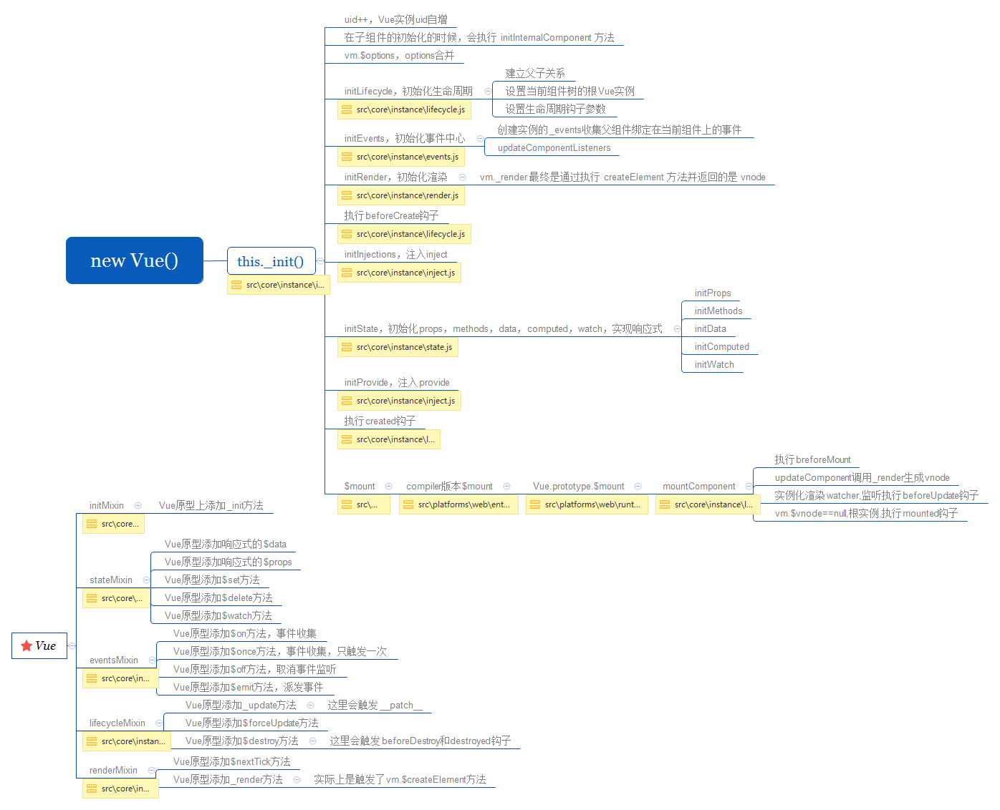

# new Vue 发生了什么



> 实例化Vue后,会执行this._init方法,这个方法通过initMixin封装vue函数的原型

```
// 代码在/core/instance/index.js中

    import { initMixin } from './init'
    import { stateMixin } from './state'
    import { renderMixin } from './render'
    import { eventsMixin } from './events'
    import { lifecycleMixin } from './lifecycle'
    import { warn } from '../util/index'

    function Vue (options) {
    if (process.env.NODE_ENV !== 'production' &&
        !(this instanceof Vue)
    ) {
        warn('Vue is a constructor and should be called with the `new` keyword')
    }
    this._init(options)
    }

    initMixin(Vue) // 给Vue原型注册_init方法
    stateMixin(Vue) // Vue原型注册$data，$props，$set：新增响应式数据，$delete：删除响应式数据，$watch：新增用户watcher
    eventsMixin(Vue) // Vue原型注册事件中心，$on，$once，$off，$emit
    lifecycleMixin(Vue) // Vue原型添加_update方法，$forceUpdate方法，$destory方法
    renderMixin(Vue) // Vue原型添加$nextTick方法，_render方法

    export default Vue
```

## _init方法

- 初始化生命周期函数
- 初始化事件
- 初始化render
- 执行生命周期beforeCreate
- 初始化vue实例的inject
- 初始化组件定义的的props, data, commputed, methods等
- 初始化vue实例的provide
- 执行生命周期函数created
- 执行mount,将模型vdom挂载到真实dom上

```
// 代码在/core/instance/init.js中
// expose real self
    vm._self = vm
    initLifecycle(vm) // 添加组件生命周期变量，建立父子关系
    initEvents(vm) 
    initRender(vm) // 注册$createElement方法
    callHook(vm, 'beforeCreate') // 执行beforeCreate钩子函数
    initInjections(vm) // resolve injections before data/props
    initState(vm) // 初始化props，data，computed，methods等
    initProvide(vm) // resolve provide after data/props
    callHook(vm, 'created') // 执行created钩子函数

/* istanbul ignore if */
    if (process.env.NODE_ENV !== 'production' && config.performance && mark) {
      vm._name = formatComponentName(vm, false)
      mark(endTag)
      measure(`vue ${vm._name} init`, startTag, endTag)
    }

    if (vm.$options.el) {
      vm.$mount(vm.$options.el)
    }
```

## initLifecycle初始化生命周期

```
// 代码在/core/instance/lifecycle.js中
    const options = vm.$options
```

> 在mergeOptions后把实例的$options赋值给options

```
// locate first non-abstract parent
    let parent = options.parent
    if (parent && !options.abstract) {
        while (parent.$options.abstract && parent.$parent) { // 如果父组件不是抽象组件，并且存在$parent，直到找到这个父实例
            parent = parent.$parent
        }
        parent.$children.push(vm) // 往这个父实例push自身
    }
```

> 定位第一个"非抽象"的父组件

- keep-alive 缓存不活动组件实例的抽象组件
- transition 动画抽象组件

> while循环内的条件parent.$options.abstract && parent.$parent,如果父实例parent是抽象组件，则继续找parent上的parent。直到找到非抽象组件为止,之后把当前vm实例push到定位的第一个非抽象parent的$children属性上

[参考链接initLifecycle](https://segmentfault.com/a/1190000014849342)

```
    vm.$parent = parent
    vm.$root = parent ? parent.$root : vm // 找到根节点

    vm.$children = [] // 创建子组件队列
    vm.$refs = {} // 通过ref注册的所有子组件
    vm._watcher = null
    vm._inactive = null // keep-alive时用到是否active
    vm._directInactive = false // 使用keep-alive的状态参数
    vm._isMounted = false // mounted之后状态修改成true
    vm._isDestroyed = false // 组件distory前，将_isDestoryed状态改为true
    vm._isBeingDestroyed = false // 调用distory时该状态修改成true，防止重复调用$destory
```
| 名称 | 说明 |
| ---- | ---- |
| $parent | 已创建的实例的父实例,建立两者的父子关系,在开发中我们可以通过this.parent访问父实例,子实例会被推入父实例的children中 |
| $root | 当前组件树的根Vue实例,如果当前没有父实例,那就是自己 |
| $children | 当前实例的子组件,无序的 |
| $refs | 对象,通过ref注册的所有子组件 |
| _watcher | 组件实例对应的watcher实例对象 |
| _inactive | keep-alive组件的状态 激活/未激活 true/false |
| _directInactive | keep-alive组件状态属性 |
| _isMounted | 当前实例是否挂在完成,对应mounted生命周期钩子 |
| _isDestoryed | 当前实例是否已销毁,对应destoryed生命周期钩子 |
| _isBeingDestoryed | 当前实例正在被销毁,对应beforeDestory和destoryed中间 |

## initEvents初始化事件

```
// 代码在/core/instance/events.js中

    export function initEvents (vm: Component) {
        vm._events = Object.create(null)
        vm._hasHookEvent = false
        // init parent attached events
        const listeners = vm.$options._parentListeners
        if (listeners) {
            updateComponentListeners(vm, listeners)
        }
    }
```

> 给vm实例创建一个_events来存储事件对象
>> vm._events表示的是父组件绑定在当前组件上的事件

```
    vm._hasHookEvent = false
```

> 表示父组件是否通过"@hook:"把钩子函数绑定在当前组件

```
    if (listeners) {
        updateComponentListeners(vm, listeners)
    }
```

> 事件存在,调用updateComponentListeners更新这些方法

#### updateComponentListeners方法

- listeners 父组件绑定在当前组件上的事件
- oldListeners 当前组件上旧的事件
- add方法
- remove方法
- createOnceHandler方法
- vm上下文实例

```
    function add (event, fn) {
        target.$on(event, fn)
    }
    // 在/core/instance/index.js中初始化
    Vue.prototype.$on = function (event: string | Array<string>, fn: Function): Component {
        const vm: Component = this
        if (Array.isArray(event)) {
            for (let i = 0, l = event.length; i < l; i++) {
                vm.$on(event[i], fn)
            }
        } else {
            (vm._events[event] || (vm._events[event] = [])).push(fn)
            // optimize hook:event cost by using a boolean flag marked at registration
            // instead of a hash lookup
            if (hookRE.test(event)) {
                vm._hasHookEvent = true
            }
        }
        return vm
    }
```

> _events是表示直接绑定在组件上的事件,我们也可以通过$on去添加自定义事件,把事件缓存在_events对象中,在后面$emit中去触发

```
    function remove (event, fn) {
        target.$off(event, fn)
    }
    Vue.prototype.$once = function (event: string, fn: Function): Component {
        const vm: Component = this
        function on () {
            vm.$off(event, on)
            fn.apply(vm, arguments)
        }
        on.fn = fn
        vm.$on(event, on)
        return vm
    }
    Vue.prototype.$off = function (event?: string | Array<string>, fn?: Function): Component {
        const vm: Component = this
        // all
        if (!arguments.length) {
            vm._events = Object.create(null)
            return vm
        }
        // array of events
        if (Array.isArray(event)) {
            for (let i = 0, l = event.length; i < l; i++) {
                vm.$off(event[i], fn)
            }
            return vm
        }
        // specific event
        const cbs = vm._events[event]
            if (!cbs) {
            return vm
        }
        if (!fn) {
            vm._events[event] = null
            return vm
        }
        // specific handler
        let cb
        let i = cbs.length
        while (i--) {
            cb = cbs[i]
            if (cb === fn || cb.fn === fn) {
                cbs.splice(i, 1)
                break
            }
        }
        return vm
    }
```

> $once方法与$on,$once会在调用$on之前去调用$off去移除监听方法,再去执行回调函数