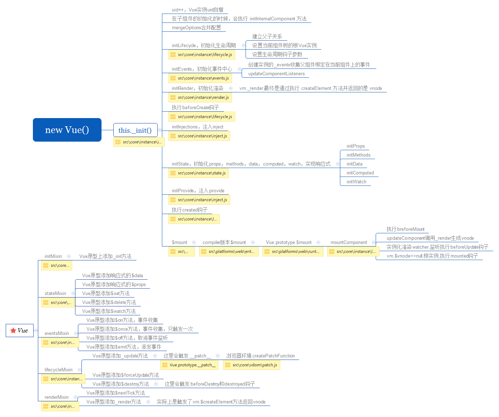

# new Vue 发生了什么



> 实例化Vue后，会执行this._init方法，这个方法通过initMixin封装vue函数的原型

```
// 代码在/core/instance/index.js中

    import { initMixin } from './init'
    import { stateMixin } from './state'
    import { renderMixin } from './render'
    import { eventsMixin } from './events'
    import { lifecycleMixin } from './lifecycle'
    import { warn } from '../util/index'

    function Vue (options) {
    if (process.env.NODE_ENV !== 'production' &&
        !(this instanceof Vue)
    ) {
        warn('Vue is a constructor and should be called with the `new` keyword')
    }
    this._init(options)
    }

    initMixin(Vue) // 给Vue原型注册_init方法
    stateMixin(Vue) // Vue原型注册$data，$props，$set：新增响应式数据，$delete：删除响应式数据，$watch：新增用户watcher
    eventsMixin(Vue) // Vue原型注册事件中心，$on，$once，$off，$emit
    lifecycleMixin(Vue) // Vue原型添加_update方法，$forceUpdate方法，$destory方法
    renderMixin(Vue) // Vue原型添加$nextTick方法，_render方法

    export default Vue
```

## _init方法

- 合并配置
- 初始化生命周期函数
- 初始化事件
- 初始化render
- 执行生命周期beforeCreate
- 初始化vue实例的inject
- 初始化组件定义的的props， data， commputed， methods等
- 初始化vue实例的provide
- 执行生命周期函数created
- 执行mount，将模型vdom挂载到真实dom上

```
// 代码在/core/instance/init.js中
// expose real self
    ...

    if (options && options._isComponent) {
      // optimize internal component instantiation
      // since dynamic options merging is pretty slow, and none of the
      // internal component options needs special treatment.
      initInternalComponent(vm, options)
    } else {
      vm.$options = mergeOptions(
        resolveConstructorOptions(vm.constructor),
        options || {},
        vm
      )
    }
    ...

    vm._self = vm
    initLifecycle(vm) // 添加组件生命周期变量，建立父子关系
    initEvents(vm) 
    initRender(vm) // 注册$createElement方法
    callHook(vm， 'beforeCreate') // 执行beforeCreate钩子函数
    initInjections(vm) // resolve injections before data/props
    initState(vm) // 初始化props，data，computed，methods等
    initProvide(vm) // resolve provide after data/props
    callHook(vm， 'created') // 执行created钩子函数

    if (vm.$options.el) {
      vm.$mount(vm.$options.el)
    }
```