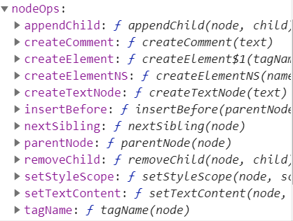

# update

> _update方法会在首次渲染和数据更新时触发,目的是把VNode渲染成真实的DOM节点,
该方法是通过lifecycleMixin方法添加到Vue原型上的,
代码定义在src/core/instance/lifecycle.js中

> lifecycleMixin给Vue原型添加了3个方法

- _update
- $forceUpdate
- $destroy

```
    export function lifecycleMixin (Vue: Class<Component>) {
        Vue.prototype._update = function (vnode: VNode, hydrating?: boolean) {
            const vm: Component = this
            const prevEl = vm.$el
            // 获取上一次的vnode
            const prevVnode = vm._vnode
            const restoreActiveInstance = setActiveInstance(vm)
            // 缓存当前的vnode,在下一次执行_update时对比vnode
            vm._vnode = vnode
            // Vue.prototype.__patch__ is injected in entry points
            // based on the rendering backend used.
            // 没有prevVnode首次渲染
            if (!prevVnode) {
                // initial render
                vm.$el = vm.__patch__(vm.$el, vnode, hydrating, false /* removeOnly */)
            } else {
                // updates
                vm.$el = vm.__patch__(prevVnode, vnode)
            }
            restoreActiveInstance()
            // update __vue__ reference
            if (prevEl) {
                prevEl.__vue__ = null
            }
            if (vm.$el) {
                vm.$el.__vue__ = vm
            }
            // if parent is an HOC, update its $el as well
            if (vm.$vnode && vm.$parent && vm.$vnode === vm.$parent._vnode) {
                vm.$parent.$el = vm.$el
            }
        }
        ...
        ...
    }

```

## _update方法实现

> _update 的核心就是调用 vm.__patch__ 方法,定义在src/platforms/web/runtime/index.js中,
在浏览器环境中__patch__实现是通过patch方法,定义在src/platforms/web/runtime/patch.js中

```
    // install platform patch function
    Vue.prototype.__patch__ = inBrowser ? patch : noop

    // src/core/instance/lifecycle.js
    if (!prevVnode) {
      // initial render
        vm.$el = vm.__patch__(vm.$el, vnode, hydrating, false /* removeOnly */)
    } else {
      // updates
        vm.$el = vm.__patch__(prevVnode, vnode)
    }
```

### createPatchFunction

> patch方法实现是通过调用createPatchFunction,该方法支持传入一个对象,包含nodeOps和modules两个参数,方法定义在
src/core/vdom/patch.js中

> nodeOps封装了一系列DOM操作的方法,定义在src/platforms/web/runtime/node-ops.js中



> modules定义了一些模块的钩子函数的实现,baseModules即vdom相关,定义在src/core/vdom/modules/index.js；
platformModules即web平台相关,定义在src/platforms/web/runtime/modules/index.js,包含了节点操作的方法
