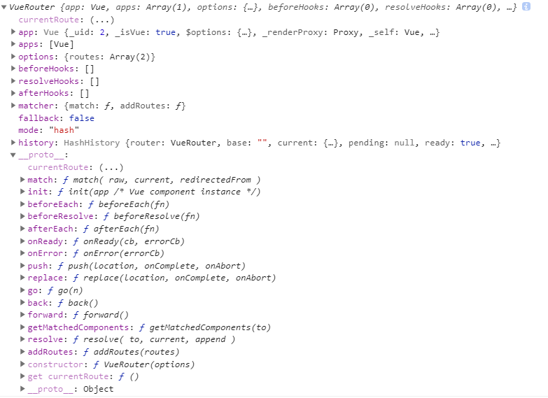

# vue-router 3.1.6

> 先看下Vuex仓库的目录结构

```
- vue-router
    - src
        - components
            - link.js
            - view.js
        - history
            - abstract.js 
            - base.js
            - errors.js
            - hash.js
            - html5.js
        - util
            - async.js
            - dom.js
            - location.js
            - misc.js
            - params.js
            - path.js
            - push-state.js
            - query.js
            - resolve-components.js
            - route.js
            - scroll.js
            - state-key.js
            - warn.js
        - create-matcher.js
        - create-route-map.js
        - index.js
        - install.js
```

## Vue.use(Router)

> 执行vue-router中定义的install方法，Vue.use方法注册在vue/src/core/global-api/use.js中


```
    export function initUse (Vue: GlobalAPI) {
        Vue.use = function (plugin: Function | Object) {
            const installedPlugins = (this._installedPlugins || (this._installedPlugins = []))
            if (installedPlugins.indexOf(plugin) > -1) { // 防止重复注册
                return this
            }

            // additional parameters
            const args = toArray(arguments, 1)
            args.unshift(this)
            if (typeof plugin.install === 'function') {
                plugin.install.apply(plugin, args) // 调用plugin定义好的install方法
            } else if (typeof plugin === 'function') {
                plugin.apply(null, args)
            }
            installedPlugins.push(plugin) // 把plugin存入队列防止重复注册
            return this
        }
    }
```

## VueRouter.install

> VueRouter.install = install，静态方法install 定义在src/install.js中

> 通过Vue.mixin在执行beforeCreate钩子时把我们传入的router混入到Vue实例上，this._routerRoot表示Vue实例本身，this._router表示传入的router实例，通过this._router.init(this)初始化VueRouter，调用Vue.util.defineReactive(this, '_route', this._router.history.current)，把_route变成响应式对象，通过Object.defineProperty在Vue的原型上添加$router和$route，注册RouterView和RouterLink组件，初始化路由的全局钩子mergeHook，把路由钩子存放在一个数组中



```
    export function install (Vue) {
        if (install.installed && _Vue === Vue) return // 防止重复installed
        install.installed = true // 第一次执行后installed赋值true

        _Vue = Vue // 把传入的Vue赋值给全局的_Vue

        const isDef = v => v !== undefined

        const registerInstance = (vm, callVal) => {
            let i = vm.$options._parentVnode
            if (isDef(i) && isDef(i = i.data) && isDef(i = i.registerRouteInstance)) { // RouterView 组件内部定义了该方法
                i(vm, callVal)
            }
        }

        Vue.mixin({
            beforeCreate () {
            if (isDef(this.$options.router)) { // 我们在new Vue时传入的VueRouter对象，会在mergeOptions时把router合并配置到$options上
                this._routerRoot = this // _routerRoot即Vue实例本身
                this._router = this.$options.router // VueRouter实例赋值给_router
                this._router.init(this) // 执行VueRouter原型方法init初始化路由，添加监听
                Vue.util.defineReactive(this, '_route', this._router.history.current) // _route添加响应式，后面路由重新rander
            } else {
                this._routerRoot = (this.$parent && this.$parent._routerRoot) || this // 往最近的父实例上找
            }
            registerInstance(this, this)
            },
            destroyed () {
                registerInstance(this)
            }
        })

        Object.defineProperty(Vue.prototype, '$router', {
            get () { return this._routerRoot._router } // 访问this.$router即可以拿到router对象
        })

        Object.defineProperty(Vue.prototype, '$route', {
            get () { return this._routerRoot._route }
        })

        Vue.component('RouterView', View)
        Vue.component('RouterLink', Link)

        const strats = Vue.config.optionMergeStrategies
        // use the same hook merging strategy for route hooks
        // 路由全局钩子mergeHook 在vue中全局生命周期钩子初始化时created = mergeHook
        strats.beforeRouteEnter = strats.beforeRouteLeave = strats.beforeRouteUpdate = strats.created
    }
```

> Vue生命周期钩子初始化，我们在[合并配置mergeOptions](https://github.com/leefinder/vue-analysis-sbs/tree/master/%E5%90%88%E5%B9%B6%E9%85%8D%E7%BD%AEmergeOptions)中讲到过

```
    LIFECYCLE_HOOKS.forEach(function (hook) {
        strats[hook] = mergeHook;
    });
    function mergeHook (
        parentVal,
        childVal
    ) {
        var res = childVal
        ? parentVal
            ? parentVal.concat(childVal)
            : Array.isArray(childVal)
            ? childVal
            : [childVal]
        : parentVal;
        return res
        ? dedupeHooks(res)
        : res
    }
```

## new VueRouter

> new VueRouter时会把我们提前约定好的路由配置传入，this.app即根Vue实例


```
    export default class VueRouter {
        static install: () => void;
        static version: string;

        app: any;
        apps: Array<any>;
        ready: boolean;
        readyCbs: Array<Function>;
        options: RouterOptions;
        mode: string;
        history: HashHistory | HTML5History | AbstractHistory;
        matcher: Matcher;
        fallback: boolean;
        beforeHooks: Array<?NavigationGuard>;
        resolveHooks: Array<?NavigationGuard>;
        afterHooks: Array<?AfterNavigationHook>;

        constructor (options: RouterOptions = {}) {
            this.app = null // Vue根实例
            this.apps = [] 
            this.options = options // 传入的路由配置
            this.beforeHooks = [] // router.beforeEach 注册的全局前置守卫
            this.resolveHooks = [] // 导航确认前的全局守卫，在组件内守卫解析后调用
            this.afterHooks = [] // 全局后置钩子
            this.matcher = createMatcher(options.routes || [], this) // 路由匹配映射 返回 match 和 addRoutes 

            let mode = options.mode || 'hash' // 默认hash路由
            this.fallback = mode === 'history' && !supportsPushState && options.fallback !== false
            if (this.fallback) { // 判断当前浏览器是否支持history路由，否则降级处理
                mode = 'hash'
            }
            if (!inBrowser) {
                mode = 'abstract'
            }
            this.mode = mode

            switch (mode) {
            case 'history':
                this.history = new HTML5History(this, options.base)
                break
            case 'hash':
                this.history = new HashHistory(this, options.base, this.fallback)
                break
            case 'abstract':
                this.history = new AbstractHistory(this, options.base)
                break
            default:
                if (process.env.NODE_ENV !== 'production') {
                assert(false, `invalid mode: ${mode}`)
                }
            }
        }
        ...
    }
```

## createMatcher

> createMatcher实际上是返回了match和addRoutes两个方法，match方法会在执行history.transformTo时用到，addRoutes是用来动态配置路由的，方法定义在src/create-matcher.js中

```
function createMatcher (routes, router) {
    const { pathList, pathMap, nameMap } = createRouteMap(routes) // 方法定义在src/create-route-map.js中
    function addRoutes (routes) {
        createRouteMap(routes, pathList, pathMap, nameMap) // routes是新增的动态路由，pathList，pathMap，nameMap是上一次存下来的，闭包的形式获取上一次的路由配置，进行合并
    }
    function match () { ... }
    function redirect () { ... }
    function alias () { ... }
    function _createRoute () { ... }
    return {
        match,
        addRoutes
    }
}
```

> addRoutes用来动态配置路由，实际上是调用createRouteMap方法,createRouteMap会去遍历我们传入的路由配置调用addRouteRecord，返回pathList，pathMap，nameMap这3个对象

```
/**
* routes 就是我们传入的路由配置
* oldPathList 第一次执行的时候是传入undefined， 第二次执行addRoutes 会把上一次的路径保存下来，传入
* oldPathMap 第一次执行的时候是传入undefined
* oldNameMap 第一次执行的时候是传入undefined
*/
function createRouteMap (routes, oldPathList, oldPathMap, oldNameMap) {
    const pathList: Array<string> = oldPathList || [] // 初始化pathList，数组
    // $flow-disable-line
    const pathMap: Dictionary<RouteRecord> = oldPathMap || Object.create(null) // 初始化的pathMap，初始化一个新对象，没有继承Object的任何原型
    // $flow-disable-line
    const nameMap: Dictionary<RouteRecord> = oldNameMap || Object.create(null)

    routes.forEach(route => {
        addRouteRecord(pathList, pathMap, nameMap, route)
    })
}
```

> addRouteRecord，递归执行，把route配置转化成record对象，维护一个route的树状关系

> normalizePath拼接一个完整的路由地址，record.path = normalizedPath，如果path的第一个字符是'/'就返回这个path，否则拼接上父路径，如果没有父路径也直接返回，这个path存在pathList数组中；path到record的映射关系存放在pathMap中；vue的路由配置支持name字段配置，这里通过nameMap记录name到record的映射关系

```example

父路径 /parent
子路径 /child
最终路径 /child

父路径 /parent
子路径 child
最终路径 /parent/child

```

```
function addRouteRecord (pathList, pathMap, nameMap, route, parent, matchAs) {
    const pathToRegexpOptions: PathToRegexpOptions =
    route.pathToRegexpOptions || {}
    const normalizedPath = normalizePath(path, parent, pathToRegexpOptions.strict)

    if (typeof route.caseSensitive === 'boolean') {
        pathToRegexpOptions.sensitive = route.caseSensitive
    }

    const record: RouteRecord = {
        path: normalizedPath, // 一个完整的路由地址
        regex: compileRouteRegex(normalizedPath, pathToRegexpOptions),
        components: route.components || { default: route.component }, // 路由配置传入的组件对象
        instances: {}, // 组件实例
        name, // 通过name匹配路由
        parent, // 当前record的父record
        matchAs,
        redirect: route.redirect, // 重定向
        beforeEnter: route.beforeEnter, // 路由配置的钩子
        meta: route.meta || {}, // 路由的meta对象
        props:
        route.props == null
            ? {}
            : route.components
            ? route.props
            : { default: route.props }
    }
    if (route.children) {
        // Warn if route is named, does not redirect and has a default child route.
        // If users navigate to this route by name, the default child will
        // not be rendered (GH Issue #629)
        if (process.env.NODE_ENV !== 'production') {
            if (
                route.name &&
                !route.redirect &&
                route.children.some(child => /^\/?$/.test(child.path))
            ) {
                warn(
                false,
                `Named Route '${route.name}' has a default child route. ` +
                    `When navigating to this named route (:to="{name: '${
                    route.name
                    }'"), ` +
                    `the default child route will not be rendered. Remove the name from ` +
                    `this route and use the name of the default child route for named ` +
                    `links instead.`
                )
            }
        }
        route.children.forEach(child => { // 递归创建children的record
            const childMatchAs = matchAs
                ? cleanPath(`${matchAs}/${child.path}`)
                : undefined
            addRouteRecord(pathList, pathMap, nameMap, child, record, childMatchAs)
        })
        if (!pathMap[record.path]) {
            pathList.push(record.path) // 记录完整的路由地址
            pathMap[record.path] = record // 记录path到record的映射关系
        }
        if (route.alias !== undefined) { // 路由别名这个先不看了
            ...
        }
        if (name) {
            if (!nameMap[name]) {
                nameMap[name] = record // 记录name到record的映射关系
            } else if (process.env.NODE_ENV !== 'production' && !matchAs) {
                warn(
                    false,
                    `Duplicate named routes definition: ` +
                    `{ name: "${name}", path: "${record.path}" }`
                )
            }
        }
    }
}
```

## this._router.init

> Vue初始化时如果传入router，会在执行beforeCreate钩子函数时，执行this._router.init，this._router就是传入的router实例

```
    init (app: any /* Vue component instance */) {
        process.env.NODE_ENV !== 'production' && assert(
        install.installed,
        `not installed. Make sure to call \`Vue.use(VueRouter)\` ` +
        `before creating root instance.`
        )

        this.apps.push(app) // app即Vue实例

        // set up app destroyed handler
        // https://github.com/vuejs/vue-router/issues/2639
        app.$once('hook:destroyed', () => {
            // clean out app from this.apps array once destroyed
            const index = this.apps.indexOf(app)
            if (index > -1) this.apps.splice(index, 1)
            // ensure we still have a main app or null if no apps
            // we do not release the router so it can be reused
            if (this.app === app) this.app = this.apps[0] || null
        })

        // main app previously initialized
        // return as we don't need to set up new history listener
        if (this.app) {
            return
        }

        this.app = app

        const history = this.history

        if (history instanceof HTML5History) {
            history.transitionTo(history.getCurrentLocation())
        } else if (history instanceof HashHistory) {
            const setupHashListener = () => {
                history.setupListeners()
            }
            history.transitionTo(
                history.getCurrentLocation(),
                setupHashListener,
                setupHashListener
            )
        }

        history.listen(route => {
            this.apps.forEach((app) => {
                app._route = route
            })
        })
    }
```

> 执行init时传入的app即vue实例，然后通过apps把app存起来，然后拿到history对象，执行history.transtionTo方法，transtionTo方法定义在src\history\base.js文件中

```
    transitionTo (
        location: RawLocation,
        onComplete?: Function,
        onAbort?: Function
    ) {
        const route = this.router.match(location, this.current) // 在VueRouter初始化开始定义的matcher.match方法
        this.confirmTransition(
            route,
            () => {
                this.updateRoute(route)
                onComplete && onComplete(route)
                this.ensureURL()

                // fire ready cbs once
                if (!this.ready) {
                this.ready = true
                this.readyCbs.forEach(cb => {
                    cb(route)
                })
                }
            },
            err => {
                if (onAbort) {
                onAbort(err)
                }
                if (err && !this.ready) {
                this.ready = true
                this.readyErrorCbs.forEach(cb => {
                    cb(err)
                })
                }
            }
        )
    }
```

## match方法

> match方法实际上是调用了createMatcher返回的match

```
    match (
        raw: RawLocation,
        current?: Route,
        redirectedFrom?: Location
    ): Route {
        return this.matcher.match(raw, current, redirectedFrom)
    } 
```

> match方法，把传入的raw和currentRoute做处理后返回一个新的路径，会对有name属性和只有path属性的分别处理，有name属性的通过nameMap去获取，没有name的情况下回去遍历pathList，通过匹配regex，path，params创建路径

```
    function match (
        raw: RawLocation,
        currentRoute?: Route,
        redirectedFrom?: Location
    ): Route {
        const location = normalizeLocation(raw, currentRoute, false, router)
        const { name } = location

        if (name) {
            const record = nameMap[name] // 从nameMap获取record
            if (process.env.NODE_ENV !== 'production') {
                warn(record, `Route with name '${name}' does not exist`)
            }
            if (!record) return _createRoute(null, location) // 如果record不存在则返回一个空路径
            const paramNames = record.regex.keys
                .filter(key => !key.optional)
                .map(key => key.name)

            if (typeof location.params !== 'object') {
                location.params = {}
            }

            if (currentRoute && typeof currentRoute.params === 'object') {
                for (const key in currentRoute.params) {
                    if (!(key in location.params) && paramNames.indexOf(key) > -1) {
                        location.params[key] = currentRoute.params[key]
                    }
                }
            }

            location.path = fillParams(record.path, location.params, `named route "${name}"`)
            return _createRoute(record, location, redirectedFrom)
        } else if (location.path) {
            location.params = {}
            for (let i = 0; i < pathList.length; i++) {
                const path = pathList[i]
                const record = pathMap[path]
                if (matchRoute(record.regex, location.path, location.params)) {
                    return _createRoute(record, location, redirectedFrom)
                }
            }
        }
        // no match
        return _createRoute(null, location)
    }
```

## 路由守卫

> [官网完整的导航解析](https://router.vuejs.org/zh/guide/advanced/navigation-guards.html#%E5%AE%8C%E6%95%B4%E7%9A%84%E5%AF%BC%E8%88%AA%E8%A7%A3%E6%9E%90%E6%B5%81%E7%A8%8B)流程是这么说明的

1. 导航被触发。
2. 在失活的组件里调用离开守卫。
3. 调用全局的 beforeEach 守卫。
4. 在重用的组件里调用 beforeRouteUpdate 守卫 (2.2+)。
5. 在路由配置里调用 beforeEnter。
6. 解析异步路由组件。
7. 在被激活的组件里调用 beforeRouteEnter。
8. 调用全局的 beforeResolve 守卫 (2.5+)。
9. 导航被确认。
10. 调用全局的 afterEach 钩子。
11. 触发 DOM 更新。
12. 用创建好的实例调用 beforeRouteEnter 守卫中传给 next 的回调函数。

> 这里我通过例子说明整个流程，在页面初始化的时候，会主动调用一次history.transitionTo，然后执行this.confirmTransition方法，传入新的route，onComplete成功方法，onAbort异常方法，接着去调用isSameRoute比较传入的路由和当前路由是否相同，否则通过resolveQueue方法获取updated，activated，deactivated三个RouteRecord，即更新的路由配置，激活的路由配置，失活的路由配置，方法实现很简单，就是通过去比较当前的matched参数和传入的新的matched参数，因为我们之前matched是通过路由访问的先后顺序传入的，因此只要去获取current和route第一个不同的下标即可

```
    function resolveQueue (
        current: Array<RouteRecord>,
        next: Array<RouteRecord>
    ): {
        updated: Array<RouteRecord>,
        activated: Array<RouteRecord>,
        deactivated: Array<RouteRecord>
    } {
        let i
        const max = Math.max(current.length, next.length)
        for (i = 0; i < max; i++) {
            if (current[i] !== next[i]) {
            break
            }
        }
        return {
            updated: next.slice(0, i),
            activated: next.slice(i),
            deactivated: current.slice(i)
        }
    }
```

> 把路由守卫钩子存到queue队列中，顺序是失活组件beforeRouteLeave钩子，beforeEach全局钩子，组件的beforeRouteUpdate钩子，待激活组件的路由配置beforeEnter钩子，待激活的异步组件，然后执行runQueue函数，runQueue函数的第一个参数就是传入的钩子，第二个参数是iterator迭代器方法，第三个参数是成功后的回调函数,回调中又执行了一次runQueue，这次传入的是待激活组件的beforeRouteEnter钩子，beforeResolve钩子,最后执行onComplete去调用this.updateRoute(route)，执行afterEach全局钩子，这个钩子不需要传next，执行this.cb回调，this.cb回调我们在_init时通过history.listen注册保存在cb数组中，这里会执行路由更新，然后执行beforeRouteEnter中next方法

```
    runQueue(queue, iterator, () => {
        const postEnterCbs = []
        const isValid = () => this.current === route
        // wait until async components are resolved before
        // extracting in-component enter guards
        const enterGuards = extractEnterGuards(activated, postEnterCbs, isValid)
        const queue = enterGuards.concat(this.router.resolveHooks)
        runQueue(queue, iterator, () => {
            if (this.pending !== route) {
            return abort()
            }
            this.pending = null
            onComplete(route)
            if (this.router.app) {
            this.router.app.$nextTick(() => {
                postEnterCbs.forEach(cb => {
                    cb()
                })
            })
            }
        })
    })

    updateRoute (route: Route) {
        const prev = this.current
        this.current = route
        this.cb && this.cb(route)
        this.router.afterHooks.forEach(hook => {
            hook && hook(route, prev)
        })
    }
```

